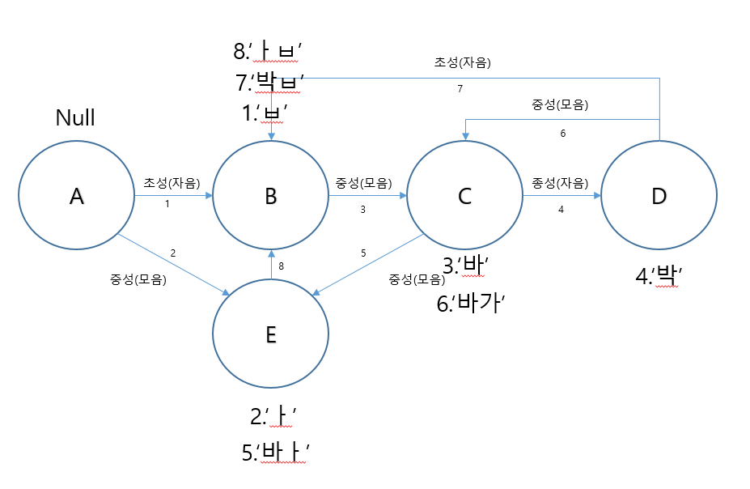

# Keyboard-Sample
안드로이드 키보드 샘플입니다.
* onclickevent를 통해 keyevent송수신(V)
* 한글 오토마타 기능 완성(이중모음, 이중자음)(V)
* 한글패드, 영문패드, 숫자패드, 특수기호패드 기능 추가(V)
* Key입력 시 소리 또는 진동 추가(사용자가 커스텀 가능하도록)(V)
* Long Click 입력 시 글자 변경 기능 추가(변경되는 기호는 미정)
* 키보드뷰 상단에 자주 쓰는 키패드를 추가할 수 있는 기능(텍스트 붙여넣기, 이모티콘, 커서이동 등등)(V)
* 천지인 자판, 이모티콘(V), 키보드 크기 조정(V)

### 1. Service
> - currentInputConnection: 현재 커서를 담고 있는 인덱스를 알고 추가, 변경, 삭제기능을 담당.
> - 현재 입력 상태에 따라 FrameLayout을 통해 KeyboardKorean, KeyboardEnglish, KeyboardSimbols, KeyboardNumpad, KeyboardEmoji로 변경된다.
> - 입력상태를 변환하기 위한 KeyboardInteractionListener 구현
> - 키보드의 높이를 정의하는 KeyboardSettingListener 구현
> - 사용자가 커스텀한 View를 추가하는 부분이 추가됨.
> - 한손조작모드 기능 추가

> #### KeyboardAction
> - 모든 종류의 키보드에서 구현되는 keyboard format layout
> - 키보드의 종류에 따라 정의된 Text로 구현됨

### 2. HangulMaker
> - 한글 오토마타를 정의하기 위한 Class
> - 4가지의 상태를 가지고 다음 입력값을 판단, commit한다.
> - 상태2, 상태3의 경우 이중모음 입력, 이중자음 입력을 판단하여 Text를 완성시킨다.

### 3. KeyboardView & Keyboard
> - API level 29 부터 deprecate되기 때문에 삭제한다.

### 4. Automata
> - firstmodel의 경우 "", "ㅂ", "바", "박", "ㅏ" 의 다섯가지 상태를 가짐.
> - 각자의 상태에서 기대되는 다음 입력에 따라 상태가 변함.
> - 이중모음, 이중자음은 Flag를 통하여 처리

